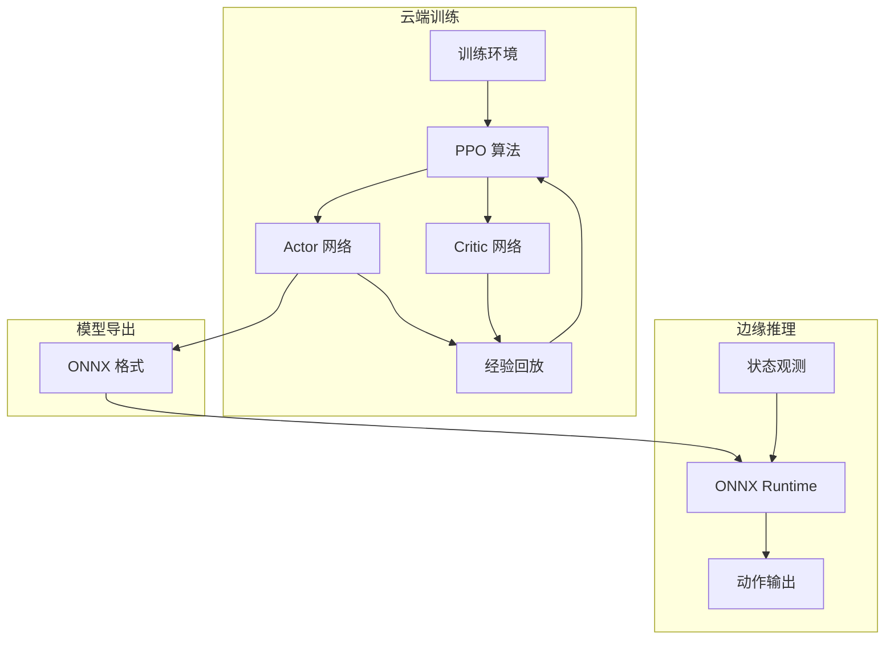
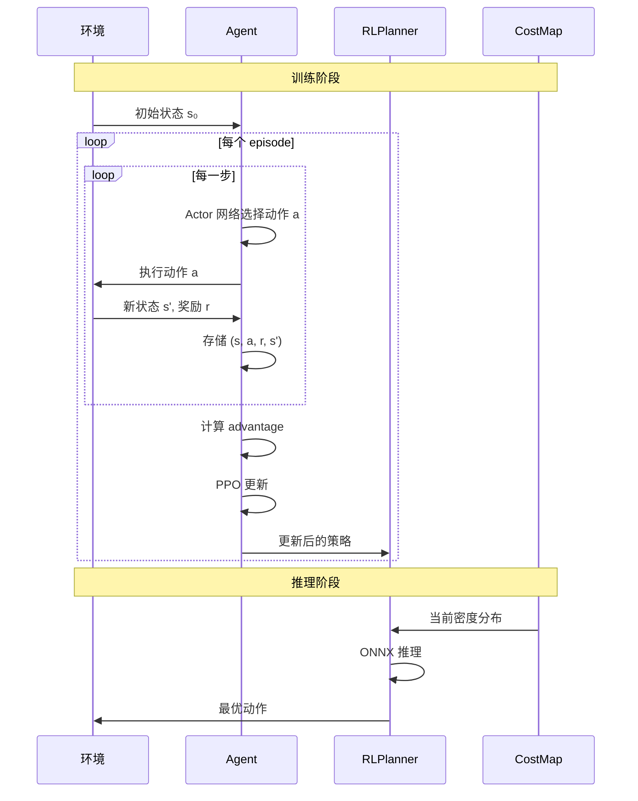

**Breadcrumbs:** [Docs](../../../README.md) / [Developer Guide](../../index.md) / [Architecture](../index.md) / [Algorithms](index.md) / Rl Planning

# RL 路径规划算法

## 概述

Aurora-Edge-Runtime 采用 **PPO (Proximal Policy Optimization)** 强化学习算法进行智能路径规划。算法在云端训练，模型导出为 ONNX 格式后在边缘侧部署推理。

## 算法架构



## 状态空间设计

### 自动驾驶模式 (25维)

| 维度 | 变量 | 说明 |
|------|------|------|
| 0-1 | position | 归一化坐标 (x, y) |
| 2-3 | goal | 目标相对位置 |
| 4-7 | local_costmap | 局部代价地图 4 方向 |
| 8-11 | obstacles | 障碍物距离 4 方向 |
| 12-15 | lane_info | 车道信息 |
| 16-19 | traffic_info | 交通状态 |
| 20-21 | velocity | 当前速度 |
| 22-23 | budget | 剩余资源 |
| 24 | reachability | 可达性标志 |

### 人形机器人模式 (43维)

| 索引 | 组件 | 维度 | 归一化 | 来源 |
|------|------|------|--------|------|
| 0-2 | 基座线速度 | 3 | ×2.0 | LivelyBot odom |
| 3-5 | 基座角速度 | 3 | ×1.0 | LivelyBot odom |
| 6-7 | 归一化位置 | 2 | x/W, y/H | odom + map |
| 8-9 | 朝向 | 2 | sin,cos | odom theta |
| 10-11 | 目标方向 | 2 | sin,cos | 目标方位角 |
| 12-14 | 目标距离 | 3 | /max_range | 距目标Δx,Δy,‖Δ‖ |
| 15-22 | 数据价值扇区 | 8 | [0,1] | CostMap 8方向扫描 |
| 23-26 | 障碍物扇区 | 4 | /max_range | CostMap 射线检测 |
| 27-28 | 当前位置价值 | 2 | [0,1] | DataValueModel |
| 29-30 | 采集状态 | 2 | [0,1] | collected_ratio, coverage |
| 31 | 地形类型 | 1 | /6 | 地形分类 |
| 32 | 障碍密度 | 1 | [0,1] | 局部密度 |
| 33 | 步态相位 | 1 | sin(2πφ) | LivelyBot |
| 34-41 | 动作历史 | 8 | raw | 最近8步 forward_vel |
| 42 | 剩余预算 | 1 | [0,1] | 时间/步数 |

## 动作空间设计

### Auto 模式：离散动作空间 (4维)

| 动作 | 值 | 说明 |
|------|-----|------|
| FORWARD | 0 | 向前移动 |
| LEFT | 1 | 向左移动 |
| RIGHT | 2 | 向右移动 |
| BACKWARD | 3 | 向后移动 |

### Humanoid 模式：连续动作空间 (3维)

| 索引 | 名称 | 范围 | 单位 | 说明 |
|------|------|------|------|------|
| 0 | forward_vel | [-0.3, 0.6] | m/s | 前进/后退速度 |
| 1 | lateral_vel | [-0.3, 0.3] | m/s | 侧向速度 |
| 2 | angular_vel | [-0.3, 0.3] | rad/s | 角速度 |

ONNX 模型输出 [-1, 1] 归一化值，通过反归一化映射到实际速度范围。动作范围与 LivelyBot Pi 训练范围对齐。

## 奖励函数设计

### 奖励组成

```cpp
class RewardCalculator {
public:
    double computeReward(const StateInfo& prev,
                        const StateInfo& curr) {
        double reward = 0;

        // 1. 稀疏区域探索奖励 (主要)
        if (curr.visited_new_sparse) {
            reward += exploration_bonus_;
        }

        // 2. 数据采集成功奖励
        if (curr.trigger_success) {
            reward += trigger_reward_;
        }

        // 3. 碰撞惩罚
        if (curr.collision) {
            reward += collision_penalty_;
        }

        // 4. 步数惩罚 (鼓励高效路径)
        reward += step_penalty_;

        // 5. 形状奖励 (引导探索)
        reward += shapingReward(curr.distance_to_sparse);

        return reward;
    }

private:
    double exploration_bonus_ = 10.0;   // 探索奖励
    double trigger_reward_ = 0.5;       // 触发奖励
    double collision_penalty_ = -50.0;  // 碰撞惩罚
    double step_penalty_ = -0.01;       // 步数惩罚
};
```

### 奖励权重配置

`config/planner_weights.yaml`:

```yaml
reward:
  visit_sparse_area: 10.0
  trigger_success: 0.5
  collision: -50.0
  step_penalty: -0.01
  inefficient_path: -5.0
  repeat_visit: -2.0

# 形状奖励
shaping:
  enabled: true
  distance_decay: 0.1
  sparse_attraction: 1.0
```

## PPO 算法实现

### Actor-Critic 网络结构

```cpp
class PPOAgent {
public:
    PPOAgent(const PPOConfig& config);

    // 选择动作
    int selectAction(const std::vector<double>& state,
                    bool deterministic = false);

    // 更新网络
    void update(const std::vector<Trajectory>& trajectories);

    // 保存/加载权重
    bool saveWeights(const std::string& filepath);
    bool loadWeights(const std::string& filepath);

private:
    // Actor 网络 (策略网络)
    std::unique_ptr<NeuralNetwork> actor_;

    // Critic 网络 (价值网络)
    std::unique_ptr<NeuralNetwork> critic_;

    PPOConfig config_;
};
```

### 网络架构

```
输入: [batch_size, state_dim]
    ↓
隐藏层 1: Linear(state_dim, 256) + ReLU
    ↓
隐藏层 2: Linear(256, 128) + ReLU
    ↓
隐藏层 3: Linear(128, 64) + ReLU
    ↓
    ├─ Actor 头: Linear(64, action_dim) + Softmax/连续输出
    └─ Critic 头: Linear(64, 1)
```

- Auto 模式: state_dim=25, action_dim=4, Actor 输出 Softmax 概率分布
- Humanoid 模式: state_dim=43, action_dim=3, Actor 输出连续动作均值

### PPO 损失函数

```cpp
double PPOAgent::computePPO_Loss(
    const Batch& batch,
    const std::vector<double>& old_log_probs,
    const std::vector<double>& values
) {
    // 1. 计算比率
    double ratio = std::exp(new_log_prob - old_log_prob);

    // 2. 裁剪目标
    double clipped_ratio = std::clamp(ratio, 1 - epsilon_, 1 + epsilon_);

    // 3. 策略损失
    double policy_loss = -std::min(ratio * advantage,
                                  clipped_ratio * advantage);

    // 4. 价值损失
    double value_loss = mse(predicted_value, target_value);

    // 5. 熵正则化
    double entropy_loss = -entropy * entropy_coef_;

    return policy_loss + value_loss * value_coef_ + entropy_loss;
}
```

## 边缘推理

### ONNX 模型加载

```cpp
class ONNXInferenceEngine {
public:
    bool loadModel(const std::string& model_path) {
        // 创建环境
        env_ = Ort::Env(ORT_LOGGING_LEVEL_WARNING, "dcp_inference");

        // 创建会话选项
        Ort::SessionOptions session_options;
        session_options.SetIntraOpNumThreads(1);
        session_options.SetGraphOptimizationLevel(
            GraphOptimizationLevel::ORT_ENABLE_ALL
        );

        // 加载模型
        session_ = Ort::Session(env_, model_path.c_str(), session_options);

        // 获取输入输出信息
        input_name_ = session_.GetInputName(0, allocator_);
        output_name_ = session_.GetOutputName(0, allocator_);

        return true;
    }

    std::vector<float> infer(const std::vector<float>& input) {
        // 创建输入张量
        auto memory_info = Ort::MemoryInfo::CreateCpu(
            OrtArenaAllocator, OrtMemTypeDefault
        );

        std::vector<int64_t> input_shape = {1, static_cast<int64_t>(input.size())};
        Ort::Value input_tensor = Ort::Value::CreateTensor<float>(
            memory_info, input.data(), input.size(),
            input_shape.data(), input_shape.size()
        );

        // 运行推理
        auto output_tensors = session_.Run(
            Ort::RunOptions{nullptr},
            &input_name_, &input_tensor, 1,
            &output_name_, 1
        );

        // 提取结果
        float* output_data = output_tensors[0].GetTensorMutableData<float>();
        size_t output_size = output_tensors[0].GetTensorTypeAndShapeInfo().GetElementCount();

        return std::vector<float>(output_data, output_data + output_size);
    }

private:
    Ort::Env env_;
    Ort::Session session_{nullptr};
    Ort::AllocatorWithDefaultOptions allocator_;
    const char* input_name_ = nullptr;
    const char* output_name_ = nullptr;
};
```

### 推理性能指标

| 指标 | 数值 |
|------|------|
| 模型加载时间 | < 100ms |
| 单次推理延迟 | < 10ms |
| 内存占用 | < 50MB |
| CPU 占用 (单核) | < 30% |

## 训练配置

### PPO 超参数

```yaml
# config/planner_weights.yaml

ppo:
  # 学习率
  learning_rate: 0.0003

  # 折扣因子
  gamma: 0.999

  # GAE 参数
  gae_lambda: 0.95

  # PPO 裁剪参数
  clip_epsilon: 0.2

  # 熵系数
  entropy_coef: 0.01

  # 价值损失系数
  value_coef: 0.5

  # 批大小
  batch_size: 64

  # 训练轮数
  epochs: 10

  # 最大梯度范数
  max_grad_norm: 0.5
```

### 课程学习策略

```python
class CurriculumLearning:
    def __init__(self):
        self.stages = [
            # 阶段 1: 小网格，近距离
            {"grid_size": 5, "goal_distance": 5, "episodes": 1000},
            # 阶段 2: 中等网格
            {"grid_size": 10, "goal_distance": 10, "episodes": 2000},
            # 阶段 3: 大网格
            {"grid_size": 20, "goal_distance": 20, "episodes": 3000},
            # 阶段 4: 随机目标
            {"grid_size": 20, "goal_distance": "random", "episodes": 5000},
        ]

    def get_current_stage(self, episode_count):
        cum_episodes = 0
        for stage in self.stages:
            cum_episodes += stage["episodes"]
            if episode_count < cum_episodes:
                return stage
        return self.stages[-1]
```

## 代价地图集成

### 动态代价调整

```cpp
class CostMapIntegrator {
public:
    // 根据数据密度更新代价
    void updateCosts(const Heatmap& density_map) {
        for (int y = 0; y < height_; ++y) {
            for (int x = 0; x < width_; ++x) {
                double density = density_map.getDensity(x, y);

                if (density < sparse_threshold_) {
                    // 稀疏区域降低代价
                    setCost(x, y, base_cost_ - exploration_bonus_);
                } else {
                    // 密集区域增加代价
                    setCost(x, y, base_cost_ + redundancy_penalty_);
                }
            }
        }
    }

private:
    double sparse_threshold_ = 0.15;
    double exploration_bonus_ = 10.0;
    double redundancy_penalty_ = 5.0;
    double base_cost_ = 1.0;
};
```

## 算法流程



## 评估指标

### 训练评估

| 指标 | 说明 |
|------|------|
| Episode Reward | 每回合累积奖励 |
| Success Rate | 成功到达目标的比例 |
| Average Length | 平均步数 |
| Coverage | 区域覆盖率 |
| Sparse Coverage | 稀疏区域覆盖率 |

### 推理评估

| 指标 | 说明 |
|------|------|
| Inference Time | 单次推理时间 |
| Memory Usage | 内存占用 |
| Path Quality | 路径质量评分 |
| Data Efficiency | 数据采集效率 |
