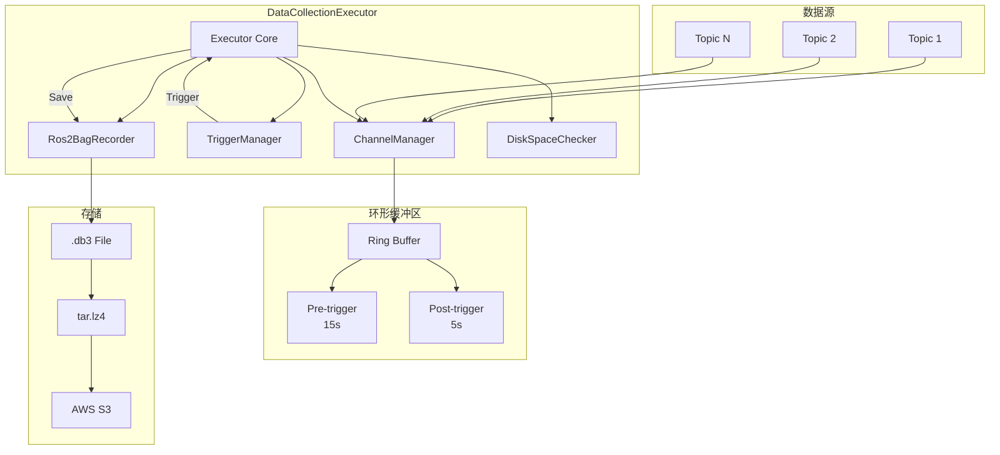
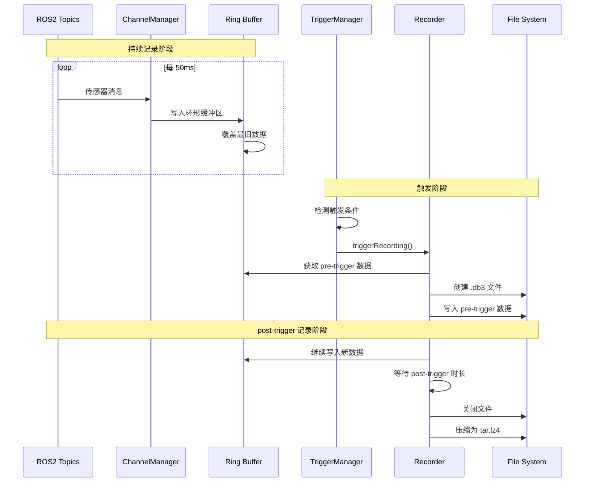

# 数据采集执行器 (DataCollectionExecutor)

## 概述

`DataCollectionExecutor` 是数据采集系统的核心执行组件，负责协调传感器数据的采集、缓存和持久化。它采用**环形缓冲区**机制实现"触发前+触发后"的数据记录，确保关键场景数据的完整性。

## 设计目标

1. **零延迟触发**：环形缓冲区持续记录，触发时立即保存前后数据
2. **灵活配置**：通过 JSON 配置动态管理采集策略
3. **资源可控**：磁盘空间检查和自动文件轮转
4. **热加载支持**：运行时重载配置无需重启

## 架构设计



## 核心组件

### 1. ChannelManager

管理 ROS2 Topic 订阅和数据分发。

```cpp
class ChannelManager {
public:
    // 订阅配置的 topics
    bool subscribe(const std::vector<TopicConfig>& configs);

    // 注册观察者（如 Ros2BagRecorder）
    void registerObserver(std::shared_ptr<MessageObserver> observer);

    // 分发消息到所有观察者
    void publish(const TopicMessage& msg);
};
```

### 2. Ros2BagRecorder

基于环形缓冲区的 ROS2 bag 录制器。

| 配置项 | 说明 | 默认值 |
|--------|------|--------|
| `forward_duration` | 触发前缓存时长 | 15s |
| `backward_duration` | 触发后录制时长 | 5s |
| `mode` | 缓存模式 (ring/fifo) | ring |

### 3. TriggerManager

管理多种触发器策略。

```cpp
class TriggerManager {
public:
    // 注册触发器
    void registerTrigger(std::shared_ptr<ITrigger> trigger);

    // 检查是否应该触发
    bool shouldTrigger(const TriggerContext& context);
};
```

## 数据流



## 配置文件结构

`config/robot_data_collection.json`:

```json
{
  "strategies": [
    {
      "id": "gait_collection",
      "name": "步态采集策略",
      "triggers": [
        {
          "type": "GaitTrigger",
          "params": {
            "min_step_distance": 0.15,
            "min_collection_interval": 1.0
          }
        }
      ],
      "topics": [
        {
          "name": "/robot/odom",
          "type": "nav_msgs/msg/Odometry",
          "frame_rate": 50
        },
        {
          "name": "/robot/joint_states",
          "type": "sensor_msgs/msg/JointState",
          "frame_rate": 100
        }
      ],
      "cache_config": {
        "mode": "ring",
        "forward_duration": 15,
        "backward_duration": 5
      }
    }
  ]
}
```

## 接口设计

### 初始化接口

```cpp
class DataCollectionExecutor {
public:
    // 从 JSON 配置初始化
    bool initialize(const std::string& json_config_path);

    // 从已解析的配置初始化
    bool initialize(const StrategyConfig& strategy_config);
};
```

### 执行接口

```cpp
// 沿路径执行采集
std::vector<DataPoint> executeAlongPath(
    const std::vector<Point>& path,
    const std::string& output_bag_path = ""
);

// 手动开始录制
bool startRecording(const std::string& output_bag_path);

// 手动停止录制
bool stopRecording();

// 基于触发器录制
bool triggerRecording(const TriggerContext& context);
```

### 配置热加载

```cpp
// 重新加载配置
bool reloadConfig(const std::string& json_config_path);
bool reloadConfig(const StrategyConfig& strategy_config);
```

## 文件命名规范

采集的 bag 文件按以下格式命名：

```
{trigger_id}_{business_type}_{timestamp}_{vin}.db3
```

示例：
```
gait_trigger_HUMANOID_20260307_143052_VIN001.db3
```

## 磁盘空间管理

### DiskSpaceChecker

监控磁盘使用情况，防止空间不足：

```cpp
class DiskSpaceChecker {
public:
    // 检查磁盘空间是否充足
    bool hasEnoughSpace(const std::string& path,
                       uint64_t required_bytes);

    // 获取可用空间
    uint64_t getAvailableSpace(const std::string& path);

    // 设置空间阈值
    void setWarningThreshold(double percentage);  // 默认 90%
    void setCriticalThreshold(double percentage); // 默认 95%
};
```

### 空间不足处理

| 状态 | 阈值 | 行为 |
|------|------|------|
| 正常 | < 90% | 继续采集 |
| 警告 | 90-95% | 记录警告，继续采集 |
| 严重 | > 95% | 停止采集，删除旧文件 |

## 使用示例

### 基本使用

```cpp
// 创建执行器
auto executor = std::make_shared<DataCollectionExecutor>(node);

// 初始化
if (!executor->initialize("config/robot_data_collection.json")) {
    RCLCPP_ERROR(node->get_logger(), "Failed to initialize executor");
    return;
}

// 设置回调
executor->setDataCallback([](const std::vector<DataPoint>& data) {
    // 处理采集的数据
});

// 沿路径采集
std::vector<Point> path = {{0, 0}, {1, 0}, {2, 0}};
auto collected = executor->executeAlongPath(path);

// 上传数据
uploader_->uploadCollectedData(collected);
```

### 配置热加载

```cpp
// ConfigWatcher 会自动调用 reloadConfig
executor->reloadConfig("config/robot_data_collection.json");
```

## 性能指标

| 指标 | 数值 |
|------|------|
| 消息处理延迟 | < 1ms |
| 环形缓冲区大小 | 可配置 (默认 20s) |
| 最大 Topic 数 | 50 |
| 单文件最大大小 | 5GB (分片上传) |

## 错误处理

| 错误类型 | 处理方式 |
|----------|----------|
| Topic 不存在 | 记录警告，继续其他 Topic |
| 磁盘空间不足 | 停止采集，尝试清理 |
| 序列化失败 | 重试 3 次 |
| 网络上传失败 | 本地缓存，稍后重试 |

## 最佳实践

1. **合理设置缓存时长**：根据场景特点设置 forward/backward 时长
2. **监控磁盘空间**：设置合适的阈值，避免采集中断
3. **使用文件轮转**：避免单个文件过大
4. **定期检查日志**：关注采集失败和重试记录
