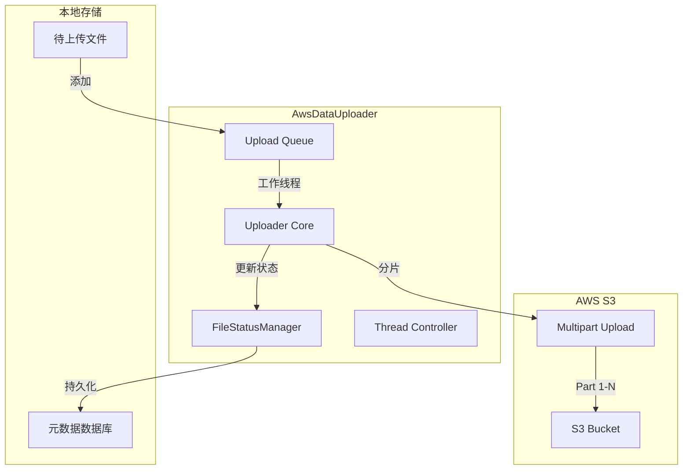
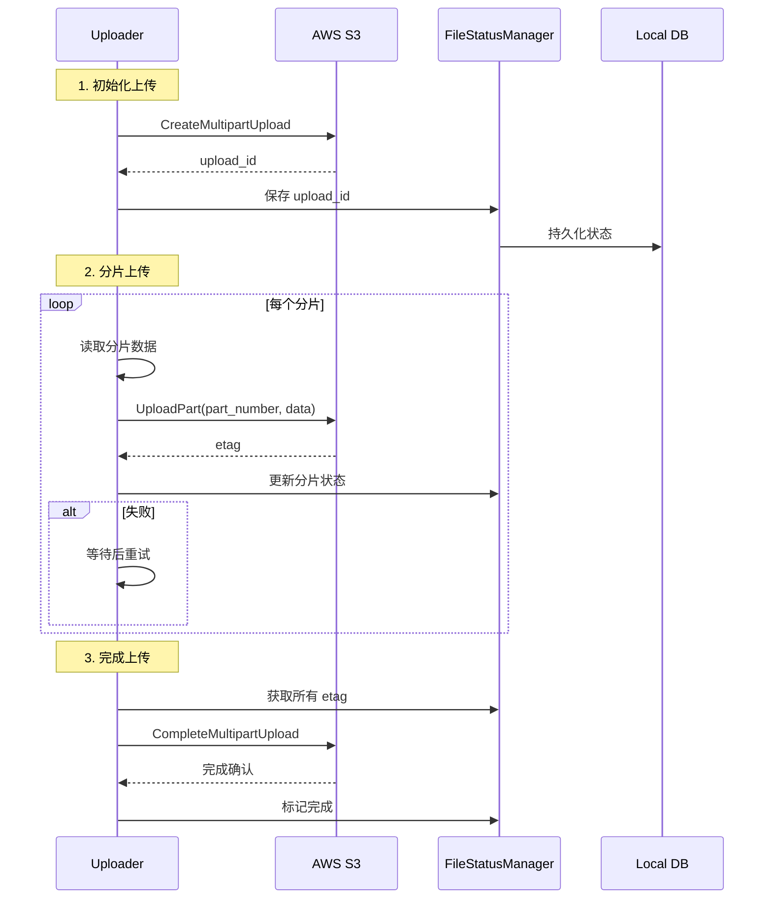

**Breadcrumbs:** [Docs](../../../README.md) / [Developer Guide](../../index.md) / [Architecture](../index.md) / [Components](index.md) / Uploader

# AWS 数据上传器 (AwsDataUploader)

## 概述

`AwsDataUploader` 负责 Aurora-Edge-Runtime 系统中采集数据的安全上传至 AWS S3 云存储。它实现了**分片上传** (Multipart Upload) 机制，支持大文件的可靠传输和断点续传。

## 设计目标

1. **大文件支持**：通过分片上传突破单次请求大小限制
2. **可靠性**：自动重试和断点续传机制
3. **安全性**：数据加密传输和存储
4. **高效性**：并发上传和进度跟踪

## 架构设计



## 核心组件

### 1. 分片上传管理

处理大文件的分片上传流程：

```cpp
class AwsDataUploader {
private:
    // 创建分片上传会话
    ErrorCode CreateMultipartUpload(
        const std::string& bucket_name,
        const std::string& object_key,
        std::string& upload_id
    );

    // 上传单个分片
    ErrorCode UploadPart(
        const std::string& bucket_name,
        const std::string& object_key,
        const std::string& upload_id,
        int part_number,
        const std::vector<char>& data,
        std::string& etag
    );

    // 完成分片上传
    ErrorCode CompleteMultipartUpload(
        const std::string& bucket_name,
        const std::string& object_key,
        const std::string& upload_id,
        const std::vector<std::pair<int, std::string>>& completed_parts
    );
};
```

### 2. FileStatusManager

管理上传状态和进度：

```cpp
class FileStatusManager {
public:
    // 添加上传任务
    void addUploadTask(const std::string& file_path,
                      const std::string& task_id);

    // 更新分片状态
    void updatePartStatus(const std::string& file_uuid,
                         int part_number,
                         const std::string& etag);

    // 获取未完成的分片
    std::vector<int> getPendingParts(const std::string& file_uuid);

    // 标记上传完成
    void markCompleted(const std::string& file_uuid);
};
```

## 分片上传流程



## 配置

### `config/app_config.json`

```json
{
  "data_upload": {
    "enable": true,
    "s3_bucket": "caic-dataset",
    "s3_region": "us-west-2",
    "chunk_size": 5242880,
    "max_concurrent_chunks": 3,
    "retry_attempts": 3,
    "retry_delay_ms": 1000,
    "timeout_ms": 30000
  }
}
```

### 配置参数说明

| 参数 | 说明 | 默认值 |
|------|------|--------|
| `chunk_size` | 分片大小 (字节) | 5MB (5242880) |
| `max_concurrent_chunks` | 最大并发分片数 | 3 |
| `retry_attempts` | 重试次数 | 3 |
| `retry_delay_ms` | 重试延迟 (毫秒) | 1000 |
| `timeout_ms` | 请求超时 (毫秒) | 30000 |

## 上传策略

### 分片大小选择

根据文件大小自动调整：

| 文件大小 | 分片大小 | 分片数量 |
|----------|----------|----------|
| < 100MB | 5MB | 1-20 |
| 100MB - 1GB | 10MB | 10-100 |
| 1GB - 5GB | 20MB | 50-250 |
| > 5GB | 50MB | 100+ |

### 并发控制

```cpp
class UploadController {
public:
    // 根据网络状况调整并发数
    void adjustConcurrency(double bandwidth_mbps);

    // 获取当前并发数
    int getCurrentConcurrency() const;

    // 设置最大并发数
    void setMaxConcurrency(int max);
};
```

## 数据结构

### 上传任务

```cpp
struct UploadTask {
    std::string file_path;        // 本地文件路径
    std::string object_key;       // S3 对象键
    std::string task_id;          // 任务 ID
    std::string upload_id;        // S3 上传 ID
    int64_t file_size;            // 文件大小
    int chunk_count;              // 分片总数
    int uploaded_count;           // 已上传分片数
    UploadStatus status;          // 上传状态
};
```

### 分片记录

```cpp
struct PartRecord {
    int part_number;              // 分片序号
    std::string etag;             // ETag 值
    int64_t size;                 // 分片大小
    UploadStatus status;          // 上传状态
    std::string error_msg;        // 错误信息
};
```

## 错误处理

### 错误码

| 错误码 | 说明 | 处理方式 |
|--------|------|----------|
| `SUCCESS` | 成功 | - |
| `NETWORK_ERROR` | 网络错误 | 重试 |
| `AUTH_ERROR` | 认证失败 | 停止上传 |
| `S3_ERROR` | S3 服务错误 | 重试 |
| `DISK_ERROR` | 磁盘错误 | 停止上传 |
| `TIMEOUT` | 超时 | 重试 |

### 重试策略

```cpp
class RetryPolicy {
public:
    // 指数退避
    std::chrono::milliseconds getBackoff(int retry_count) {
        return std::chrono::milliseconds(
            base_delay_ * std::pow(2, retry_count)
        );
    }

    // 判断是否可重试
    bool isRetryable(ErrorCode error);

private:
    int base_delay_ = 1000;  // 基础延迟 1 秒
    int max_delay_ = 30000;  // 最大延迟 30 秒
};
```

## 断点续传

### 状态持久化

```cpp
class UploadStateManager {
public:
    // 保存上传状态
    void saveState(const std::string& file_uuid,
                  const UploadState& state);

    // 加载上传状态
    bool loadState(const std::string& file_uuid,
                  UploadState& state);

    // 清理已完成状态
    void cleanupCompleted();
};
```

### 恢复上传

```cpp
ErrorCode AwsDataUploader::resumeUpload(
    const std::string& file_uuid
) {
    // 1. 加载保存的状态
    UploadState state;
    if (!state_manager_.loadState(file_uuid, state)) {
        return ErrorCode::STATE_NOT_FOUND;
    }

    // 2. 查询 S3 获取已上传的分片
    auto uploaded_parts = listParts(state.upload_id);

    // 3. 继续上传未完成的分片
    for (int i = 1; i <= state.chunk_count; ++i) {
        if (uploaded_parts.find(i) == uploaded_parts.end()) {
            uploadPart(i);
        }
    }

    // 4. 完成上传
    return completeUpload(state);
}
```

## 监控指标

| 指标 | 说明 |
|------|------|
| `upload_queue_size` | 等待上传的文件数 |
| `uploading_count` | 正在上传的文件数 |
| `uploaded_bytes` | 已上传字节数 |
| `upload_speed` | 上传速度 (MB/s) |
| `failed_count` | 失败次数 |
| `retry_count` | 重试次数 |

## 安全性

### 数据加密

```cpp
class DataEncryption {
public:
    // 加密数据
    std::vector<char> encrypt(const std::vector<char>& plaintext);

    // 解密数据
    std::vector<char> decrypt(const std::vector<char>& ciphertext);

private:
    std::string encryption_key_;  // 从配置加载
};
```

### 访问控制

- 使用 AWS IAM 角色控制访问权限
- 支持临时凭证 (STS)
- 数据传输使用 HTTPS/TLS

## 使用示例

### 基本上传

```cpp
// 创建上传器
auto uploader = std::make_shared<AwsDataUploader>();

// 初始化
AppConfigData::DataUpload config;
config.s3_bucket = "caic-dataset";
config.s3_region = "us-west-2";
uploader->Init(config);

// 启动上传器
uploader->Start();

// 上传文件
uploader->UploadFile("/data/collected.tar.lz4",
                    UploadType::ActivelyReport);
```

### 监控上传进度

```cpp
class UploadProgressCallback {
public:
    void onProgress(const FileUploadProgress& progress) {
        printf("Upload %s: %.1f%%\n",
               progress.fileName.c_str(),
               progress.progress * 100);
    }
};
```

## 性能优化

1. **并发上传**：多个分片并行上传
2. **连接复用**：HTTP Keep-Alive
3. **数据压缩**：上传前压缩减少传输量
4. **批量操作**：减少元数据请求次数

## 故障排查

| 问题 | 可能原因 | 解决方案 |
|------|----------|----------|
| 上传缓慢 | 网络带宽不足 | 降低并发数 |
| 认证失败 | 凭证过期 | 更新 AWS 凭证 |
| 分片失败 | 网络不稳定 | 增加重试次数 |
| 磁盘满 | 本地空间不足 | 清理旧文件 |
